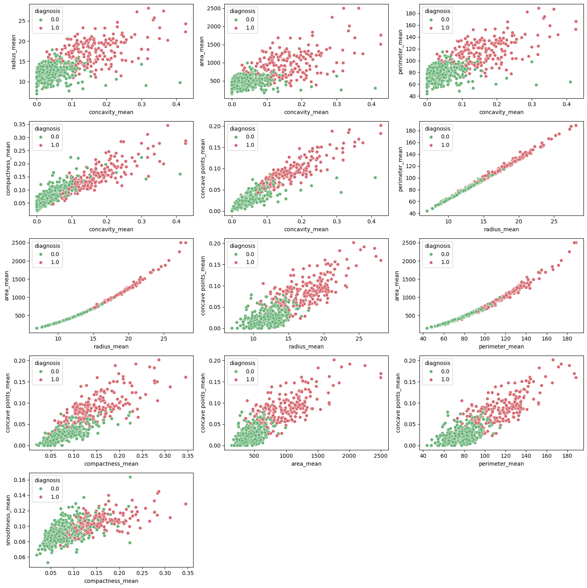
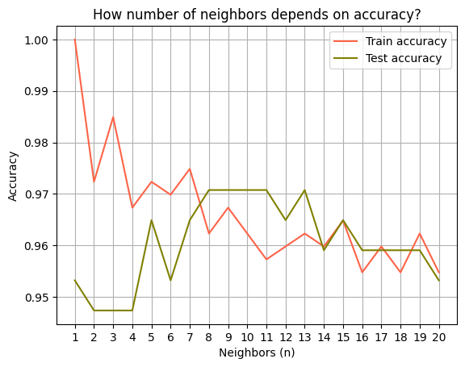
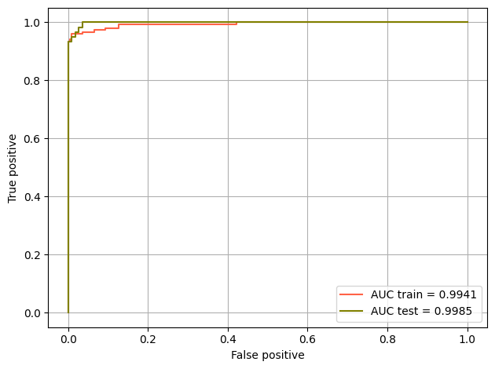
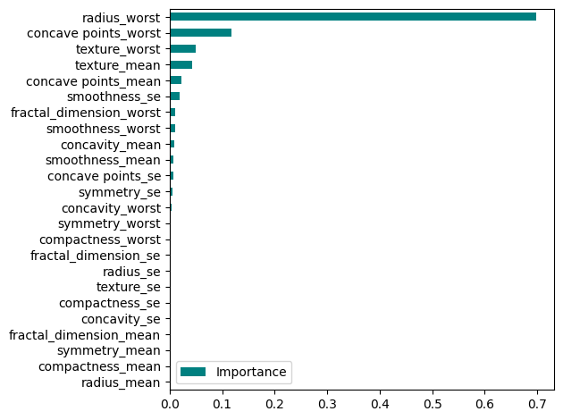

# Breast Cancer Wisconsin (Diagnostic) Data Set
[Kaggle dataset](https://www.kaggle.com/datasets/uciml/breast-cancer-wisconsin-data)

**GOAL:** predict whether the cancer is benign or malignant.  
**BEST SCORE:** 0.9956 AUC (best model - Logistic Regression)

---
## Architecture

#### EDA

The features:
1. ID number
2. Diagnosis (M = malignant, B = benign)
3. radius (mean of distances from center to points on the perimeter)
4. texture (standard deviation of gray-scale values)
5. perimeter
6. area
7. smoothness (local variation in radius lengths)
8. compactness (perimeter^2 / area - 1.0)
9. concavity (severity of concave portions of the contour)
10. concave points (number of concave portions of the contour)
11. symmetry
12. fractal dimension ("coastline approximation" - 1)

### Different models

**`K-Nearest Neighbors`**

Total metrics:
|            | Test (default) | Test (7 neighbors) |
|------------|----------------|--------------------|
|  Accuracy: | 0.9649         | 0.9649             |
| Precision: | 0.9524         | 0.9524             |
|    Recall: | 0.9524         | 0.9524             |
|  F1_score: | 0.9524         | 0.9524             |

**`Logistic Regression`**

Total metrics:
|            | Test (default) | Test (GridSearchCV) |
|------------|----------------|---------------------|
|  Accuracy: | 0.9766         | 0.9766              |
| Precision: | 0.9841         | 0.9841              |
|    Recall: | 0.9538         | 0.9538              |
|  F1_score: | 0.9688         | 0.9688              |

**`Decision Tree`**

Total metrics:
|            | Test (default) | Test (GridSearchCV) |
|------------|----------------|---------------------|
|  Accuracy: | 0.92           | 0.95                |

Feature importance:

### Best model

Best model is `Logistic Regression` tuned with GridSearchCV.
